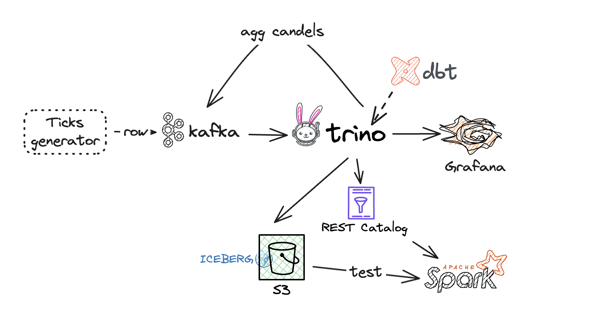

# Data Engineering Zoomcamp 2025 my project

## Functional Requirements

Need to create a pipeline - 'Stocks ticker'.

1. The pipeline will receive raw ticks/quotes from Kafka in the following format:
```json
{
	"source": "SOURCE_1",
	"symbol": "BNBUSD",
	"ask": 627.05,
	"bid": 627.04,
	"mid": 627.045,
	"askMarkup": 0,
	"bidMarkup": 0,
	"isTradable": true,
	"number": 11530579268,
	"dateTime": "2025-03-20T14:31:28.000",
	"receiveDateTime": "2025-03-20T14:31:28.386"
}
```
```json
{
	"source": "SOURCE_1",
	"symbol": "SOLUSD",
	"ask": 131.57,
	"bid": 131.56,
	"mid": 131.565,
	"askMarkup": 0,
	"bidMarkup": 0,
	"isTradable": true,
	"number": 11530579246,
	"dateTime": "2025-03-20T14:31:28.000",
	"receiveDateTime": "2025-03-20T14:31:28.279"
}
```
We need to implement a fake ticks generator using Faker Python library.

2. Schema



3. These ticks need to be aggregated into 11 candlestick charts (Japanese candlestick):
- m1  (every minute)
- m5  (every 5 minutes)
- m10 (every 10 minutes)
- m15 (every 15 minutes)
- m30 (every 30 minutes)
- h1  (every hour)
- h3  (every 3 hours)
- h4  (every 4 hours)
- D1  (every day)
- W1  (every week)
- M1  (every month)

The candlestick should be updated every minute with minimal delay.
Every candle consists of fields aggregated by source, symbol and datetime:
- dateTime
- open
- high
- low
- close
- volume (based on count for each symbol)

4. Aggregated candles should be written to different Kafka topics (candle_XY).
For this we plan to use Trino.
5. Raw ticks data and candles should be saved on S3 in Iceberg format with using a REST catalog for the convenient latest consumption
6. Candle visualization should be implemented in a Grafana dashboard for all candle types.

## Acceptance criteria: 
1. Visualized candles in Grafana
2. Ability to read data from S3 by other tools (f.e. Spark)

## Sandbox components
1. Kafka - Redpanda (ext. ports: 8082,9092,9644,28082,29092)
2. Redpanda UI (8084) [Redpanda UI](http://localhost:8084)
3. Tick generator (Python app)
4. S3 - Minio (9000)
5. Minio UI (9001) [Minio UI](http://localhost:9001)
6. Iceberg Rest Catalog (8181)
7. Trino coordinator (8090) [Trino UI](http://localhost:8090)
8. Prometheus (9090) - optional
9. DBT + Trino plugin — optional for creating trino views
10. Grafana (3030) [Grafana UI](http://localhost:3030)
11. Airflow for execute queries - optional

## Commands for reproducing the scenario
```bash
python -m venv .venv
source ./.venv/bin/activate
pip install --upgrade pip
pip install -r requirements.txt
docker compose up -d
#start ticks-generator
cd generator
python ticks-generator.py --brokers localhost:9092 --topic market_data.stock_ticks

```

Not finished yet.