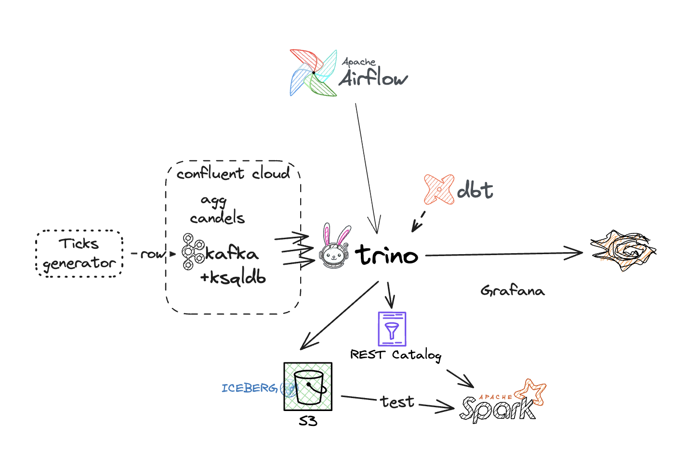

# Data Engineering Zoomcamp 2025 my project

## Functional Requirements

Need to create a pipeline - 'Stocks ticker'.

1. The pipeline will receive raw ticks/quotes from Kafka in the following format:
```json
{
	"source": "SOURCE_1",
	"symbol": "BNBUSD",
	"ask": 627.05,
	"bid": 627.04,
	"mid": 627.045,
	"askMarkup": 0,
	"bidMarkup": 0,
	"isTradable": true,
	"number": 11530579268,
	"dateTime": "2025-03-20T14:31:28.000",
	"receiveDateTime": "2025-03-20T14:31:28.386"
}
```
```json
{
	"source": "SOURCE_1",
	"symbol": "SOLUSD",
	"ask": 131.57,
	"bid": 131.56,
	"mid": 131.565,
	"askMarkup": 0,
	"bidMarkup": 0,
	"isTradable": true,
	"number": 11530579246,
	"dateTime": "2025-03-20T14:31:28.000",
	"receiveDateTime": "2025-03-20T14:31:28.279"
}
```
We need to implement a fake ticks generator using Faker Python library.

2. Schema



3. These ticks need to be aggregated into 11 candlestick charts (Japanese candlestick):
- m1  (every minute)
- m5  (every 5 minutes) - optional
- m10 (every 10 minutes)
- m15 (every 15 minutes) - optional
- m30 (every 30 minutes) - optional
- h1  (every hour)      
- h3  (every 3 hours) - optional
- h4  (every 4 hours) - optional
- D1  (every day)
- W1  (every week) - optional
- M1  (every month) - optional

The candlestick should be updated every minute with minimal delay.
Every candle consists of fields aggregated by source, symbol and datetime:
- dateTime
- open
- high
- low
- close
- volume (based on count for each symbol)

4. Aggregated candles should be written to different Kafka topics (candle_XY).
For this we plan to use Trino.
5. Raw ticks data and candles should be saved on S3 in Iceberg format with using a REST catalog for the convenient latest consumption
6. Candle visualization should be implemented in a Grafana dashboard for all candle types.

## Acceptance criteria: 
1. Visualized candles in Grafana
2. Ability to read data from S3 by other tools (f.e. Spark)

## Sandbox components 
(you need 10Gb of RAM for Docker)  
~~1. Kafka - Redpanda (ext. ports: 8082,9092,9644,28082,29092)~~  
~~2. Redpanda UI (8084) [Redpanda UI](http://localhost:8084)~~
3. Tick generator (Python app)
4. Kafka + ksqlDB in confluent cloud
5. S3 - Minio (9000)
6. Minio UI (9001) [Minio UI](http://localhost:9001) (admin:password)
7. Iceberg Rest Catalog (8181)
8. Trino coordinator (8090) [Trino UI](http://localhost:8090) (any user)
9. Prometheus (9090) - optional
10. DBT + Trino plugin — optional for creating trino 
11. BI - Grafana (3030) [Grafana UI](http://localhost:3030) (admin:admin)
12. Airflow for execute queries (8080) (airflow:airflow)

## Commands for reproducing the scenario 

1. Prepare infrastructure   
1.1. Confluent cloud (Kafka, ksqlDB)  

- [Install Terraform](https://developer.hashicorp.com/terraform/tutorials/aws-get-started/install-cli)  
- [Install Confluent CLI (option)](https://docs.confluent.io/confluent-cli/current/install.html)  
- Create trail account in [Confluent Cloud](https://www.confluent.io/get-started/) and create service account for manage your infrastructure `confluent_cloud_api_key`,`confluent_cloud_api_key`.   
You also need to add promo code `CONFLUENTDEV1` in the page https://confluent.cloud/settings/billing/payment  
for will be able to create assets w/o bank card  
```bash
cd terraform/ksql
terraform init
export TF_VAR_confluent_cloud_api_key="XU3FTJKMBAOAFH7O"
export TF_VAR_confluent_cloud_api_secret="XVlwAVbpWUi1i9C5CiLeGT6YQd6pW3UkBmVEKYla4AJYUY4pgeR5rUHHUL89bGcZ"
terraform apply
#Get IDs and Endpoints of Confluent objects
terraform output resource-ids
#You need to catch `api_key_id`, `api_key_secret` and use it with generator as `KAFKA_SASL_USERNAME`, `KAFKA_SASL_PASSWORD` accordingly
```
1.2. Up local infra in Docker compose (Trino, Airflow, Grafana, S3, REST Catalog) 
- 

2. Start data generator
```bash
cd generator
export DOCKER_DEFAULT_PLATFORM=linux/amd64
docker build . -t ticks-generator:1.0

docker run --rm -it \
--name ticks-generator \
-e KAFKA_SASL_USERNAME="ACN6N6H7YT6GCJFO" \
-e KAFKA_SASL_PASSWORD="vlHD/t7nPpDNtVoMDpRU91D0OcMNmcMnhUn5gfBwaHyzJA14/WpQlfRLkvJ5j+2T" \
ticks-generator:1.0 \
--bootstrap.servers pkc-921jm.us-east-2.aws.confluent.cloud:9092 \
--topic stock_ticks \
--security.protocol SASL_SSL

```
In the result you can see messages in the topic:


3. Create ksqldb entities 

```bash
docker run -it --rm \
  --entrypoint=/usr/bin/ksql \
  -v ./ksqldb:/home/appuser/ksqldb \
  confluentinc/cp-ksqldb-cli:latest \
  --file ksqldb/create-entities.sql \
  --query-timeout 10000 \
  -u "ZM7LLAZLJLXBCVDM" \
  -p "subjG5O3MizbQJnrg7H7k79vRbke6c2pCrIZ5frS9sAfYWjr0WUa6/2bevTZ1p0G" \
  "https://pksqlc-o26j0p.us-east-2.aws.confluent.cloud:443"
```
In the result you can see agg extra topics in the Confluent Cloud

4. Make sure everything works in [Airflow](http://localhost:8080/home) and [Grafana](http://localhost:3000/d/b0c81156-3fb5-4dce-85ed-1e30b6f32009/candlesticks?orgId=1)


5. Test reading using Spark
```bash
docker exec -it spark spark-sql
```
```sql
use demo;
select * from market_data.candle_1day_iceberg limit 10;
```

6. Delete infrastructure
```bash
docker compose down
terraform destroy
```


### In summary, here's what we've achieved:

Raw financial instrument tick data is generated and sent to Kafka. 
ksqlDB aggregates this data into trading candles with various time discretizations and sends the aggregated data to separate topics. 
The Kafka-related infrastructure is deployed using Terraform in the cloud. In real time we can use candles using any kafka client, ksqDB client or Kafka Connect REST API. 
Trino subscribes to Kafka topics with candles and, using Airflow and dbt, saves data in Iceberg format on S3, 
which allows working with this data using different tools. Visualization of trading candles occurs in Grafana, using Trino data.
It would have been possible to use sink Kafka Connect to "land" data from Kafka, but I wanted to deal with Trino.

Hope you liked it! Add me as a friend in [LinkedIn](https://www.linkedin.com/in/sergeytarabara/) 👋


